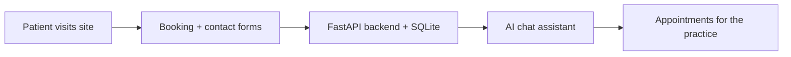

# Doctor Website

**Website for a medical practice with appointment booking, contact management and an AI chat assistant for patient questions.**

     



## Problem it solves

Small practices lose time on the phone booking appointments and answering the same questions. This site lets patients book online and get answers from a chat assistant.

Professional website for a medical studio with appointment booking, contact management, and AI assistant chatbot.

## Features
- Doctor profile with bio, credentials, specializations
- Service catalog with detailed descriptions
- Online appointment booking with date/time selection
- Contact form with message management
- AI chat assistant — answers ONLY from doctor's information
- Mobile responsive design
- Configurable for any doctor, any city

## Quick Start
```bash
pip install -r requirements.txt
cp .env.example .env   # customize doctor info
python main.py
# Open http://localhost:8000
```

## Configuration
All doctor information is configured via `.env` file:
- Name, title, specializations
- Address, phone, email, work hours
- Bio/description
- Map coordinates
- OpenAI API key for chat

## Tech Stack
FastAPI · SQLite · Jinja2 · OpenAI API · HTML/CSS/JS
